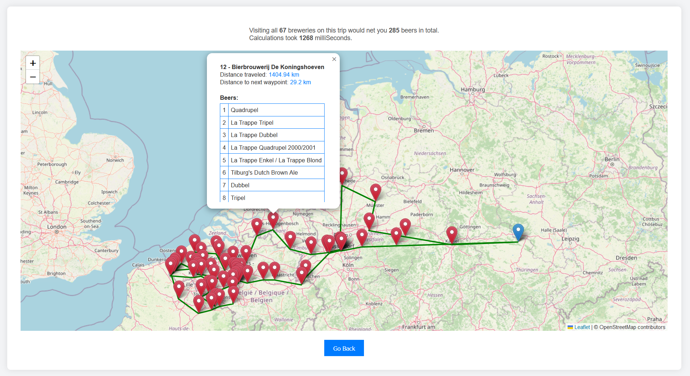

# Satalia backend homework - Beer Test




### Run
```bash
docker-compose -f ./dev_tools/docker-compose.yaml up -d 
```

### GUI URL
[http://localhost:8080/beer-test/](http://localhost:8080/beer-test/)

### Run test
```bash
./mvnw test
```

### Run IT test
```bash
./mvnw verify
```
